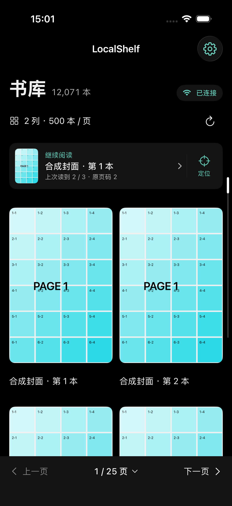
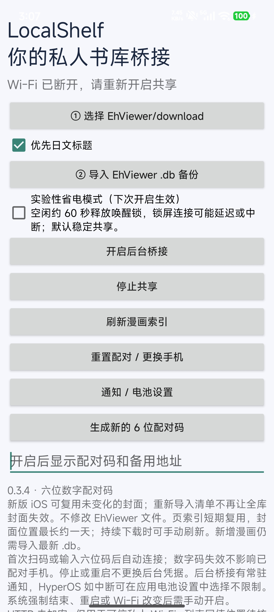

# LocalShelf

**书库留在安卓，阅读交给 iPhone。**

LocalShelf 是一套面向可信私人局域网的图片／漫画阅读工具。安卓只读桥接端分享你已下载的本地文件，iOS 原生客户端负责封面浏览、滑动翻页和阅读进度管理。无需把整套书库复制到 iPhone，也无需注册项目云端账号。

安卓与 iPhone 接入同一私人局域网，首次扫码或六位码配对后，客户端可保存凭据并再次连接。源文件始终由你管理；iOS 按需获取图片并在本机缓存，不向项目运营者上传书库。

当前公开源码：**iOS 0.4.13（39）＋安卓只读桥接 0.3.5-dev（14）**，均为开发预览版。iOS 使用 SwiftUI 与 UIKit，安卓使用原生 Java 界面；两端统一使用 eh 字母图标。

本项目不是 EhViewer 官方客户端，不附带漫画、内容网站账号、抓取、搜索或下载服务。使用者需自行提供有权访问的内容与兼容阅读服务。

## 首页预览

### iOS · 书库与继续阅读



截图来自当前公开版的 iOS 模拟器运行界面。封面、书名、数量和阅读记录均为程序生成的测试数据；“已连接”是演示状态，不代表真实服务端连接，也不是性能测试结果。

### Android · 只读书库桥接



截图由维护者提供，来自安卓 0.3.4 实机，处于 Wi-Fi 断开、共享未开启状态，不展示二维码、配对码、连接地址或真实书库内容。公开源码为 0.3.5-dev，另增加“开源许可与隐私”入口并更新图标；截图不代表该新版全部界面。

## iOS 阅读端

- 全局暗色界面、两／三列书库、每页 50–500 本、本页快速定位。
- 左右滑动翻页、底部按钮及点击／拖动页码条、左缘返回。
- 相邻页面预取、有界解码队列、最高 2 GB 封面磁盘缓存。
- 支持系统 ImageIO 能解码的静态与多帧图片；格式兼容性依赖系统版本，不保证任意编码文件可播放。
- 最近阅读、返回书库定位、按书库隔离的本地阅读进度、手动导出／恢复进度。
- 安卓与 NAS 两套连接配置，扫码或六位码配对，配对后保存凭据。
- 隐藏书库封面。此功能不是加密、访问锁或内容删除，正文仍可阅读。

## 安卓只读桥接端

- 使用系统目录授权读取下载文件，手动导入兼容 EhViewer `.db` 备份建立书库清单。
- 根据备份查询结果保留列表位置，漫画内按数字页码读取；缺失目录保留占位，不自动删除记录。
- 前台服务与常驻通知显示共享状态，可停止共享；系统强制结束或网络变化后可能需要手动重启。
- 六位码／二维码配对，已配对设备可复用凭据；支持撤销旧配对。
- 按需建立页索引、复用封面位置和修订信息，减少重复读取；可手动刷新索引。
- 不下载漫画，不改写 EhViewer 源文件；应用内提供开源许可与隐私说明。

## 快速了解工作方式

1. 安卓：授权本地下载目录，导入兼容备份，再开启后台桥接。
2. iPhone：在同一可信私人局域网内完成配对，加载书库。
3. 阅读：浏览封面、左右翻页，离开后从“继续阅读”恢复，或定位到原书库位置浏览前后条目。

这是按需联网阅读方案，不是完整离线同步工具。没有缓存的图片仍需要安卓桥接在线；新增漫画也需要重新导出并导入备份。

## 范围与前提

本仓库包含 `ios/` 和 `android/`，**不包含独立的 LocalShelf Sync 全量迁移工具或 Docker NAS 服务端**。安卓端读取用户授权的下载目录和手动导出的兼容 EhViewer `.db`。不能直接连接 SMB、WebDAV 或任意漫画服务器；NAS 需另行实现 [LocalShelf 协议](docs/PROTOCOL.md)。没有服务端也可运行 iOS 模拟器合成界面测试。

仅接受私人局域网 IPv4 的 HTTP 地址；不支持公网、域名、HTTPS 或远程穿透。NAS 阅读端口与备份上传端口不是同一个接口。首次发布书库前，NAS 服务可能返回 503。客户端不负责文件迁移，也不会修改源漫画。

**HTTP 不加密。配对、凭据、图片和访问请求可能被同网段攻击者观察或篡改。** 不用于公共／访客 Wi-Fi，不开放公网；HMAC 身份检查不等同 TLS。详见 [安全说明](SECURITY.md) 和 [隐私说明](PRIVACY.md)。

## iOS 构建

需要 macOS、Xcode 及 iOS SDK；部署目标 iOS 17.0。当前源码使用较新的 Swift 工具链；旧版 Xcode 未验证。

1. 打开 `ios/LocalShelf.xcodeproj`，选择共享 `LocalShelf` scheme。
2. 模拟器构建不需要个人开发团队。
3. 真机构建请自行设置唯一 Bundle Identifier 和自己的 Signing Team；不要提交证书、描述文件或个人 Xcode 配置。
4. 阅读器首次联网／扫码时按需授权本地网络／相机。模拟器不用于真实相机扫码验收。

iOS 无需安装第三方运行时依赖，也无需重新生成工程。`ios/project.yml` 是可选的 XcodeGen 配置。

```sh
xcodebuild -project ios/LocalShelf.xcodeproj -scheme LocalShelf \
  -configuration Release -sdk iphoneos -destination 'generic/platform=iOS' \
  -derivedDataPath build/device CODE_SIGNING_ALLOWED=NO build
sh scripts/check.sh
```

无签名构建产物不能直接安装到 iPhone。开源不提供 Apple 签名、不绕过设备限制，也不代表已通过 App Store 审核。

## 安卓构建与使用

需要 JDK 17、Gradle 8.13、Android SDK 36 和 Android Gradle Plugin 8.13.0 所需构建工具。最低安装版本 Android 10（API 29），目标 API 36。不随源码附带 SDK、个人 SDK 路径、签名密钥或构建工具二进制；使用前自行接受工具供应商协议。

在本机设置 `JAVA_HOME`、`ANDROID_HOME` 后运行：

```sh
gradle -p android assembleDebug
```

产物在 `android/app/build/outputs/apk/debug/`。这是本机构建的调试 APK；正式分发应建立独立发布密钥与升级策略，不上传密钥，也不要用一次性调试签名维护长期用户安装。

1. 在安卓连接私人 Wi-Fi，授权下载目录并导入手动导出的 `.db`。
2. 按需允许通知，开启后台桥接。通知里可确认状态或停止共享。
3. 在同一局域网的 iOS 选择安卓桥接，扫描二维码或输入安卓显示的地址和六位码。
4. 新增下载需要重新导出／导入 `.db`；“刷新索引”不等于导入新增漫画。

**顺序限制：** 读取 `DOWNLOADS` / `DOWNLOAD_DIRNAME` 并按 `TIME DESC` 保存查询结果，同值记录标记待核对，不猜测第二排序条件。缺失目录保留占位；不保证任意 EhViewer 分支的备份结构兼容。

安卓运行时依赖仅 NanoHTTPD 2.3.1（BSD-3-Clause）及 ZXing Core 3.5.3（Apache-2.0）；完整声明随源码与 APK 资源提供，可在应用内“开源许可与隐私”查看。安卓权限与本地数据说明见 [随包隐私说明](android/app/src/main/assets/licenses/PRIVACY.txt)。

## 验证与贡献

[测试说明](docs/TESTING.md) · [贡献指南](CONTRIBUTING.md) · [发布检查](docs/RELEASE_CHECKLIST.md)

提交问题时请使用合成数据，去掉书名、图片、阅读记录、服务器地址及凭据。不要上传真实漫画或个人截图。

## 许可

项目代码按 [MIT](LICENSE) 许可提供；来源与资源边界见 [致谢及许可说明](THIRD_PARTY_NOTICES.md)。这不授予第三方漫画、商标、系统 SDK 或系统符号的权利。
